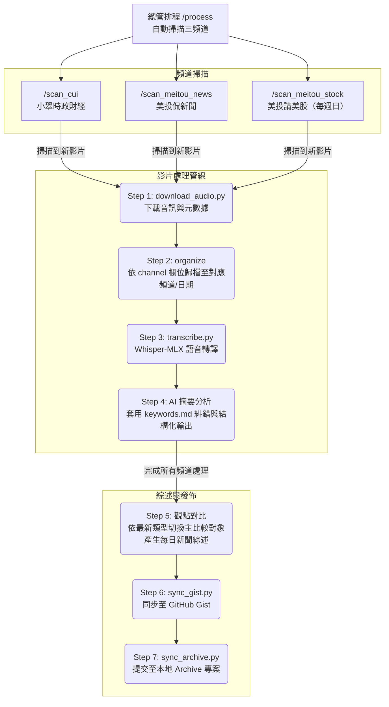

# CUI Member Skill

本專案提供了一套自動化工具與工作流（Skills），旨在將 **[小翠時政財經](https://www.youtube.com/@cui_news)**（包含「會員直播」與「每日要聞」）、**[美投侃新聞](https://www.youtube.com/@MeiTouNews)** 以及 **[美投講美股](https://www.youtube.com/@MeiTouJun)**（每週日更新）的 YouTube 影片音訊下載、轉譯為文字，並透過 AI Agent（如 Claude、GitHub Copilot、Codex 或 Antigravity）進行各自的重點摘要與投資分析，最後將各頻道的觀點進行異同對比與歸檔。

## 專案設計理念

- **AI Agent 優先 (Agent-centric)**：功能被封裝為一系列的 Scripts (Skills)，設計初衷是交由 AI Agent 閱讀 `AGENTS.md` 後自動呼叫與執行，而非完全依賴人類手動輸入指令。
- **環境隔離**：所有 Python 腳本皆使用 `uv` 管理內聯依賴（Inline dependencies），確保不污染系統全域環境。
- **靈活的模型切換**：文字轉譯功能（Whisper）支援本地端運算與雲端 API（OpenAI, Azure）。詳細規格因 OS 不同，請見下方各平台設定說明。

---

## 斜線指令（Slash Commands）一覽

將以下指令直接貼給 AI Agent（如本聊天視窗），Agent 將自動完成對應步驟。

| 指令 | 功能 | 必要輸入 |
|------|------|----------|
| `/scan_cui` | 自動檢查小翠最新直播，若未處理則觸發下載與分析 | （無） |
| `/scan_meitou_news` | 自動檢查美投侃新聞最新影片，若未處理則觸發下載與分析 | （無） |
| `/scan_meitou_stock` | 自動檢查美投講美股最新影片（每週日更新），若未處理則觸發下載與分析 | （無） |
| `/process` | **總管排程 (Orchestrator)**：自動掃描三頻道，若有新影片則執行分析，並進行觀點對比與同步 | （無） |
| `/download <YouTube URL>` | Step 1: 下載音訊與元數據 | YouTube URL |
| `/organize <mp3路徑>` | Step 2: AI 依 `channel` 欄位判斷類型，建立目錄並移動檔案 | `.mp3` 檔案路徑 |
| `/transcribe <mp3路徑>` | Step 3: 語音轉文字，產生 `.txt` 文字稿 | `.mp3` 檔案路徑 |
| `/summarize <txt路徑>` | Step 4: 讀取文字稿，輸出繁體中文投資分析報告 `summary.md` | `.txt` 檔案路徑 |
| `/compare` | Step 5: 依最新內容類型動態選擇主比較對象，產生觀點對比與異同分析（`每日新聞綜述`） | （無） |
| `/sync` | Step 6: 將各分類最新的筆記自動同步至 GitHub Gist（維持單一最新檔案，清理舊檔） | （無） |
| `/archive` | Step 7: 掃描 `./archive` 配下的 Git 專案並同步文件（安全起見需手動 Push） | （無） |

---

## 🛠️ 技術工作流與生成方式

本專案所有的分析筆記皆由自動化工作流生成，目前的完整執行架構如下：



---

## 前置需求與安裝

> ⚠️ **Mac 版** 與 **Windows 版** 的設定有所不同，請根據您的系統參考下方對應章節。

---

## 🍎 Mac 版設定（適用 Apple Silicon M3 或以上）

### 1. 安裝系統工具

```bash
# 使用 Homebrew 進行安裝
brew install yt-dlp ffmpeg uv
```

### 2. 同步 Python 專案與依賴套件

本專案已使用 `uv` 進行專案初始化與套件管理 (`pyproject.toml` / `uv.lock`)。
取得專案後，請在專案根目錄下執行以下指令以安裝並同步所需的 Python 依賴套件（如 `mlx-whisper`、`openai`、`requests` 等）：

```bash
uv sync
```

*註：`uv sync` 會自動建立 `.venv` 虛擬環境並完成所有套件安裝。*

### 3. 準備 Cookies 檔案（下載會員限定影片）

要下載會員專屬內容，需要將瀏覽器的 Cookies 傳遞給 yt-dlp。
基於目前的設定，**系統會自動嘗試從您的瀏覽器（預設為 Chrome）讀取 Cookies**，因此通常情況下您**不需手動匯出 Cookies**，即可直接執行腳本下載。

若您使用的是其他瀏覽器，請在 `.env` 檔案中修改 `COOKIES_BROWSER` 變數：
```bash
# .env 檔案
COOKIES_BROWSER=firefox  # 支援 chrome, firefox, edge, safari 等
```

#### 特殊情況：手動匯出 Cookies

只有當自動讀取 Cookies 失敗，或是您基於隱私/環境限制不希望 yt-dlp 直接存取瀏覽器資料時，才需要手動匯出 Cookies。
詳細的 Cookies 取得方式，請參考 [yt-dlp 官方文件說明](https://github.com/yt-dlp/yt-dlp/wiki/Extractors#exporting-youtube-cookies)。

- **Firefox**：使用 [cookies.txt](https://addons.mozilla.org/en-US/firefox/addon/cookies-txt/) 擴充功能
- **Chrome**：使用 [Get cookies.txt LOCALLY](https://chrome.google.com/webstore/detail/get-cookiestxt-locally/cclelndahbckbenkjhflpdbgdldlbecc) 擴充功能
  - ⚠️ 注意：「Get cookies.txt」（不含 "LOCALLY" 的版本）曾**被舉報為惡意軟體**，請絕對不要安裝。務必使用帶有 "**LOCALLY**" 字樣的版本。

請將匯出的檔案放置於 `./cookies.txt`（根據 `.env` 中的 `COOKIES_PATH` 設定）。
*請注意：Cookies 檔案包含敏感的登入資訊，絕對不要提交（Commit）到 Git 中（已在 `.gitignore` 排除）。*

### 4. 設定環境變數

```bash
cp .env.example .env
```

可以在 `.env` 中設定的主要參數：

| 變數名稱 | 說明 | 預設值 |
|--------|------|-----------|
| `WHISPER_MODE` | 轉譯模式（`local` / `openai` / `azure`） | `local` |
| `WHISPER_MODEL` | 本地端模式時的模型名稱 | `mlx-community/whisper-medium-mlx-8bit` |
| `COOKIES_PATH` | Cookies 檔案的存放路徑 | `./cookies.txt` |
| `COOKIES_BROWSER`| 從指定瀏覽器自動讀取 Cookies（**Mac 專用**，如 `firefox`, `chrome`）| （未設定） |
| `OPENAI_API_KEY` | 使用 OpenAI API 模式時為必填 | — |
| `GITHUB_TOKEN` | 同步 Gist 專用（需包含 `gist` 權限） | — |
| `GIST_ID` | 同步 Gist 專用（目標 Gist 的 ID） | — |

> ⚠️ **注意 (API 限制)**：當 `WHISPER_MODE` 設定為 `azure`（或 `openai`）時，受限於官方 API 規格，**音訊檔案大小不得超過 25MB**。對於超過此大小的影片（例如長篇直播），請務必切換為 `local` 模式進行轉譯。

### 5. 關於 Mac 的本地端轉譯模型

在 Mac（Apple Silicon）上，可以利用 **MLX 框架** 進行高速轉譯。

| 模型 | 精準度 | 處理時間預估 | 推薦用途 |
|--------|------|----------------|----------|
| `mlx-community/whisper-medium-mlx-8bit` | 普通至良好 | **預設**。30分鐘影片約需數分鐘 | 日常一般用途 |
| `mlx-community/whisper-large-v3-mlx` | 最高精準度 | **可能需要 30 分鐘以上** | 僅在極需高精準度時使用 |

> ⚠️ `whisper-large-v3-mlx` 雖然精準度高，但對於長度超過 30 分鐘的影片，**轉譯過程可能會耗時超過 30 分鐘**，請在時間充裕時再使用。

若要更換模型，請編輯 `.env` 檔案：

```bash
# .env
WHISPER_MODEL=mlx-community/whisper-large-v3-mlx
```

對於非 Apple Silicon 的 Mac（Intel Mac），系統將自動降級使用 CPU 版本的 `faster-whisper`（預設為 medium 模型）。

---

## 🪟 Windows 版設定（完全容器化支援 Docker / Podman）

Windows 版本現在採用**完全容器化**架構，不需要在主機上安裝 Python、uv、yt-dlp 或 ffmpeg。只需準備好容器環境即可。

### 1. 安裝必要工具

- 請安裝 [Docker Desktop](https://www.docker.com/products/docker-desktop/) 或 [Podman Desktop](https://podman-desktop.io/)。
  - 有 NVIDIA GPU 的環境請另行安裝 NVIDIA Container Toolkit 以支援 CUDA 加速。
- 所有 Python 工具皆在容器內執行，**主機無需安裝 Python、uv、yt-dlp 或 ffmpeg**。

### 2. 準備 Cookies 檔案（下載會員限定影片）

由於容器化環境無法直接讀取本機瀏覽器的 Cookies，要下載會員專屬內容，**必須手動匯出 Cookies**。
詳細的 Cookies 取得方式，請參考 [yt-dlp 官方文件說明](https://github.com/yt-dlp/yt-dlp/wiki/Extractors#exporting-youtube-cookies)。

- **Firefox**：使用 [cookies.txt](https://addons.mozilla.org/en-US/firefox/addon/cookies-txt/) 擴充功能
- **Chrome**：使用 [Get cookies.txt LOCALLY](https://chrome.google.com/webstore/detail/get-cookiestxt-locally/cclelndahbckbenkjhflpdbgdldlbecc) 擴充功能

請將匯出的檔案命名為 `cookies.txt`，並放置於專案根目錄下。
> ⚠️ **注意換行字元**：請確保換行字元為 **CRLF (`\r\n`)** 或 LF，格式錯誤可能會發生 `HTTP Error 400: Bad Request`。

### 3. 設定環境變數並啟動容器

```bash
copy .env.example .env
```

在 `.env` 中設定主要參數後，於 PowerShell 中執行以下指令。`load-env.ps1` 會將 `.env` 載入為環境變數（相當於 bash 的 `set -a; . .env; set +a`），並依 `USE_CUDA` 自動選擇正確的 Compose 檔與容器名稱：

```powershell
# .env 載入與環境初始化（每次開新 PowerShell 視窗時執行）
Set-ExecutionPolicy -Scope Process -ExecutionPolicy Bypass; . scripts/load-env.ps1

# 容器啟動（初次或設定變更後需加 --build）
& $env:CONTAINER_RUNTIME compose -f $env:CUI_COMPOSE_FILE up -d
```

`USE_CUDA=false`（預設）→ 使用 `Dockerfile.cpu` + `docker-compose.cpu.yml`（容器名：`cui-tools-cpu`）  
`USE_CUDA=true` → 使用 `Dockerfile`（CUDA）+ `docker-compose.cuda.yml`（容器名：`cui-tools-cuda`）

可以在 `.env` 中設定的主要參數：

| 變數名稱 | 說明 | 預設值 |
|--------|------|------|
| `WHISPER_MODE` | 轉譯模式（`local` / `openai` / `azure`） | `local` |
| `CONTAINER_RUNTIME` | 容器工具（`docker` または `podman`） | `docker` |
| `USE_CUDA` | NVIDIA GPU 加速（`true` / `false`） | `false` |
| `COOKIES_PATH` | 會員限定影片用 Cookies 檔案路徑 | `./cookies.txt` |
| `OPENAI_API_KEY` | OpenAI API モード時必填 | — |
| `AZURE_OPENAI_API_KEY` | Azure OpenAI API モード時必填 | — |
| `GITHUB_TOKEN` | 同步 Gist 專用（需 `gist` 權限） | — |
| `GIST_ID` | 同步 Gist 專用 | — |

> ⚠️ **注意 (API 限制)**：`WHISPER_MODE=azure`（或 `openai`）時，音訊檔案大小不得超過 25MB。超過此大小的影片請切換為 `local` 模式。

### 4. 在容器內執行腳本

`load-env.ps1` 實行後、以下の形式で各スクリプトを実行できます：

```powershell
& $env:CONTAINER_RUNTIME exec $env:CUI_CONTAINER uv run skills/transcribe.py docs/your-dir/audio.mp3
```

---

## 使用方法 (Workflow)

**最推薦的方式是直接使用 `/process` 指令，讓 AI Agent 自動檢查雙頻道並處理所有流程。**

### 手動執行步驟（供參考）

> **⚠️ 注意**：以下指令以 Mac 版 (`uv run`) 為例。Windows 版請先執行 `Set-ExecutionPolicy -Scope Process -ExecutionPolicy Bypass; . scripts/load-env.ps1`、その後すべての `uv run` コマンドを `& $env:CONTAINER_RUNTIME exec $env:CUI_CONTAINER uv run` に置き換えてください。

**Step 1: 下載音訊**
```bash
uv run skills/download_audio.py "https://www.youtube.com/watch?v=YOUR_VIDEO_ID"
# 會員限定影片需先準備 cookies.txt（Mac 可設定 COOKIES_BROWSER；Windows 容器環境請使用 COOKIES_PATH）
```

**Step 2: 建立分類目錄並移動檔案**（交由 AI Agent 自動判斷）
```
./docs/<Channel>/<VideoType>/<Date>/  例如: ./docs/小翠時政財經/會員直播/20260717/
```

**Step 3: 語音轉文字**
```bash
uv run skills/transcribe.py "./docs/小翠時政財經/會員直播/20260717/audio_file.mp3"
```

**Step 4: 摘要與分析**
依照 `skills/prompts/summarize.md` 的提示詞，讓 AI Agent 讀取 `.txt` 並生成 `summary.md` 報告。

**Step 5: 觀點對比分析 (每日新聞綜述)**
根據 `skills/prompts/compare.prompt.md` 的指示，AI Agent 會先判斷最新內容的類型（每日要聞/會員直播/美投侃新聞/美投講美股），再動態選擇主比較對象，產生對比分析報告。

**Step 6: 同步至 Gist (選擇性)**
將各分類的最新分析報告與每日新聞綜述上傳至 Gist，自動覆蓋並清理舊檔以維持頁面整潔。
```bash
uv run skills/sync_gist.py
```
> 💡 **如何取得 GitHub Token 與 Gist ID？**
> 1. **GitHub Token**：前往 GitHub [Personal Access Tokens (classic)](https://github.com/settings/tokens) 頁面，點擊 `Generate new token (classic)`，填寫名稱並**務必勾選 `gist` 權限**，生成後將其填入 `.env`。
> 2. **Gist ID**：前往 [GitHub Gist](https://gist.github.com/)，隨意建立一個新的 Gist。建立完成後，網址列中 `https://gist.github.com/您的帳號/` 後方的一長串英數代碼即為 `GIST_ID`。

**Step 7: アーカイブ同期 (Sync to Archive)**
若在 `./archive` 目錄下存在您的 Git 存檔專案（任意名稱的目錄），此腳本會自動將最新的 `docs/**/*.md` 拷貝至專案內，並自動執行 `git add` 與 `git commit`。
⚠️ **安全性提示**：為避免在 Docker 容器內掛載 SSH 私鑰帶來潛在的資安風險，本腳本**不會**自動執行 `git push`。請於腳本執行完畢後，手動在主機端推送至 GitHub。
```bash
uv run skills/sync_archive.py
```

---

## 專案結構

```
cui-member-skill/
├── AGENTS.md                  # 給 AI Agent 閱讀的自動化操作手冊
├── README.md                  # 本文件
├── pyproject.toml             # uv 專案設定與 Python 依賴定義
├── uv.lock                    # 依賴版本鎖定檔
├── .env.example               # 環境變數設定範本
├── .gitignore
├── Dockerfile                 # Windows CUDA 版容器映像定義檔
├── Dockerfile.cpu             # Windows CPU 版容器映像定義檔
├── docker-compose.cuda.yml    # Windows NVIDIA GPU (CUDA) 專用
├── docker-compose.cpu.yml     # Windows CPU 專用（完整獨立設定）
├── scripts/
│   └── load-env.ps1           # .env → 環境變數展開 + CUDA/CPU コンテナ自動選択（PowerShell）
├── skills/                    # 自動化技能腳本
│   ├── download_audio.py      # 音訊與中繼數據的下載
│   ├── transcribe.py          # 語音轉文字（支援 Local/OpenAI/Azure，自動判別 CPU/GPU）
│   ├── sync_gist.py           # 同步 Gist 的腳本
│   ├── sync_archive.py        # 本地 Git 專案同步（歸檔）腳本
│   └── prompts/               # 各階段專屬的 Agent 提示詞與操作說明
│       ├── process.prompt.md
│       ├── scan_cui.prompt.md
│       ├── scan_meitou_news.prompt.md
│       ├── scan_meitou_stock.prompt.md
│       ├── download.prompt.md
│       ├── organize.prompt.md
│       ├── transcribe.prompt.md
│       ├── summarize.prompt.md
│       ├── summarize.md       # 給 LLM 的分析提示詞範本
│       └── compare.prompt.md  # 觀點對比分析的 Agent 提示詞（模式 A/B/C 動態切換）
├── docs/                      # 輸出目錄（按影片類型/日期分類存放）
└── cookies.txt                # Cookies 檔案（已在 Git 中忽略）
```

## License

This project is licensed under the MIT License - see the [LICENSE](LICENSE) file for details.
