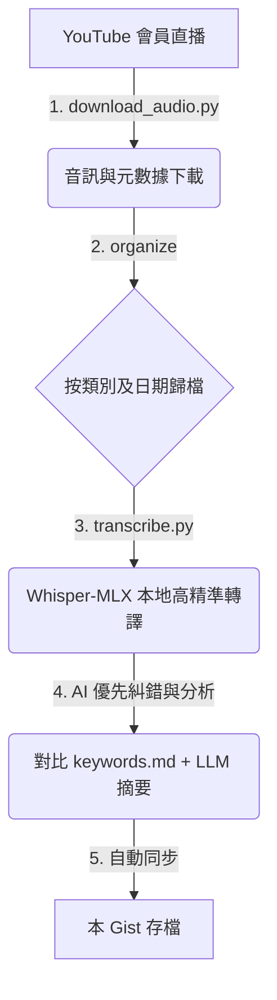

# 🎙️ 小翠時政財經 — 會員直播精華摘要與投資分析筆記

> 本 Gist 用於自動同步由 `cui-member-skill` 工具所生成的 **[小翠時政財經](https://www.youtube.com/@cui_news)** 會員限定直播之精華摘要與投資分析報告。
> 透過 AI 語音轉文字與大語言模型（LLM）的深度分析，協助訂閱會員快速掌握宏觀經濟、地緣政治及半導體產業的關鍵變動與投資邏輯。

---

## 🎯 內容大綱與定位

本筆記內容僅專注於**「會員直播」**的核心精華，涵蓋以下關鍵維度：

1. **宏觀與地緣政治分析**：解讀聯準會（Fed）貨幣政策、美中關係、韓國市場債務危機、各國產業補貼政策等對金融市場的連鎖效應。
2. **半導體與 AI 產業鏈深度追蹤**：聚焦 AI 晶片、先進封裝（CoWoS）、高頻寬記憶體（HBM）、光通訊等領域的龍頭與高成長標的。
3. **量化投資數據表**：整理講者針對個股提出的關鍵財務預測，包含：
   - 預估每股盈餘（EPS）與前瞻本益比（Forward PE）
   - 估值合理區間（進攻/防禦分批抄底價）
   - 講者對個股的看法與未來催化劑（Catalyst）分析
4. **高精準度術語修正**：結合專屬 `keywords.md` 詞彙表，全面自動修正 Whisper 語音識別常見的同音錯別字（如：「費半」誤識別為「肺斑」、「市夢率」誤識別為「是夢率」等），確保專業術語的準確傳達。

---

## 🛠️ 技術工作流與生成方式

本筆記由 [cui-member-skill](https://github.com/Automata-Theatre/cui-member-skill) 專案之自動化腳本生成：

*註：轉譯過程在 macOS 環境下採用 Apple Silicon（MLX 框架）進行本地端硬體加速運算，確保隱私與效率。*

---

## 📈 重點追蹤標的

筆記中常態性追蹤並提供估值與策略的科技巨頭與成長股包含：
- **AI/GPU 龍頭**：英偉達 (NVIDIA / NVDA)
- **先進製程代工**：台積電 (TSMC / TSM)
- **存儲與 HBM 雙雄**：美光 (Micron / MU)、SK 海力士 (SK Hynix / SKHY)
- **光通訊與防禦巨頭**：康寧 (Corning / GLW)、博通 (Broadcom / AVGO)
- **定制晶片與反轉標的**：美滿電子 (Marvell / MRVL)、英特爾 (Intel / INTC)
- **大數據與 AI 應用**：帕蘭泰爾 (Palantir / PLTR)、甲骨文 (Oracle / ORCL)

---

## ⚠️ 免責聲明 (Disclaimer)

1. **AI 輔助性質**：本筆記內容為語音轉文字稿後經由 AI 進行結構化提煉之結果。儘管已透過專屬詞彙表進行糾錯，仍可能存在部分解讀偏差，具體內容請以小翠會員直播影片原作內容為準。
2. **非投資建議**：本筆記整理之數據、估值與看法均僅供學術探討、個人學習與研究參考，不構成任何買賣要約或投資決策建議。投資人應獨立思考並自負盈虧。
